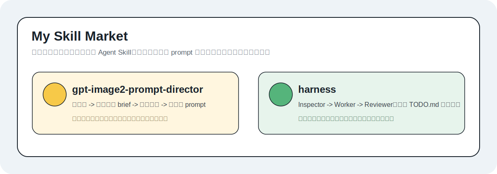
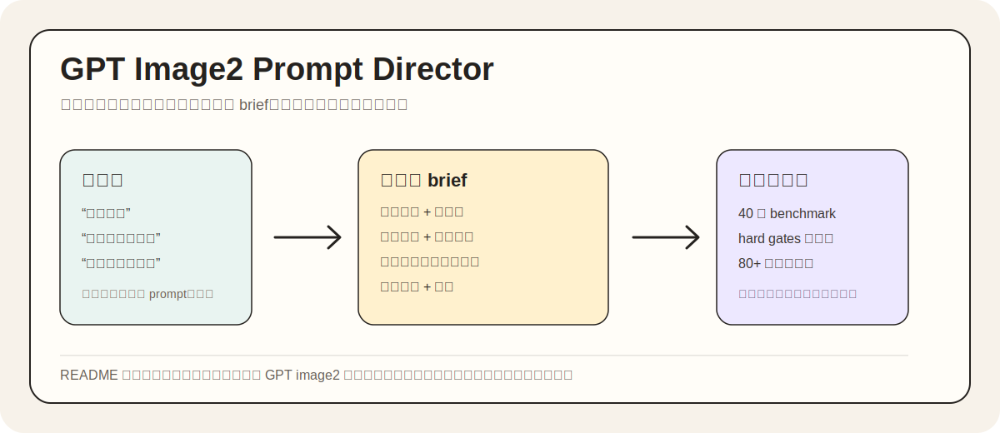
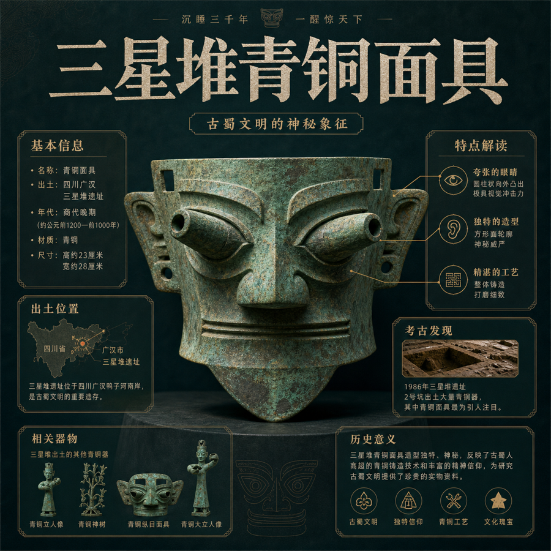
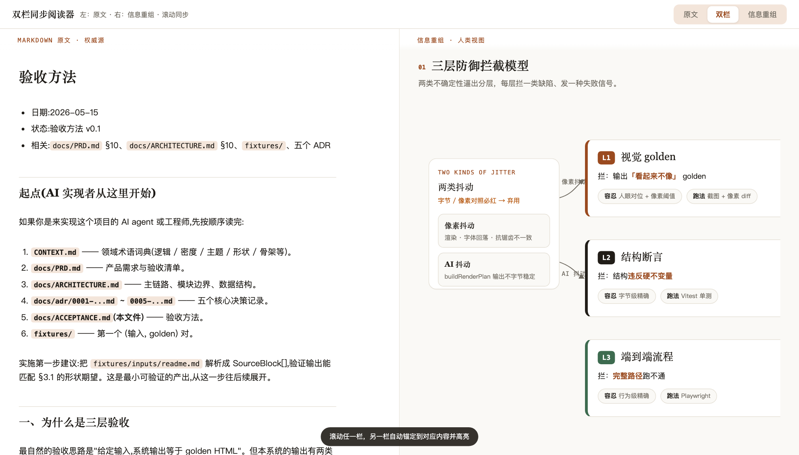

# My Skill Market

一个轻量级 Agent Skills 仓库，收录可直接复制到 Claude Code、Codex 或其他兼容 Agent skill 目录使用的工作流。



## 当前 Skills

| Skill | 一句话定位 | 适合什么时候用 | 触发词 |
| --- | --- | --- | --- |
| [gpt-image2-prompt-director](./gpt-image2-prompt-director/) | GPT image2 提示词导演，把弱点子升级成可生图、可评测的创意 brief | 做头像、表情包、信息图、平台封面、海报、产品图，或修复跑偏 prompt | `$gpt-image2-prompt-director` |
| [harness](./harness/) | Harness Engineering 最小实践，用 Inspector、Worker、Reviewer 推动代码仓库持续改进 | 想让 Agent 自动巡检、拆任务、修复、复审并维护 TODO.md 看板 | `/harness` |
| [repo-map](./repo-map/) | 本地仓库地图：扫描全部本地 git 仓库生成增量自愈索引，提到仓库名自动注入路径与读写角色，可选 macOS launchd 定时同步让新仓库自动进图 | 本地多仓库开发，跨仓库引用/修改时 AI 总要你手贴路径 | `仓库地图` / `repo-map` |
| [wechat-article-md-local](./wechat-article-md-local/) | 微信公众号文章下载为本地 Markdown，图片自动本地化 | 收到公众号文章链接，需要存档、分析或引用 | (收到 mp.weixin.qq.com 链接自动触发) |
| [x-article-download](./x-article-download/) | X/Twitter 内容下载，支持单条推文和整账号批量 | 收到 X 推文/账号链接，需要存档或分析 | (收到 x.com 链接自动触发) |
| [xiaohongshu-downloader](./xiaohongshu-downloader/) | 小红书视频下载 + Whisper 口播转录为 Markdown 逐字稿 | 收到小红书视频链接，需要分析或翻译口播内容 | (收到 xiaohongshu.com/xhslink.com 链接自动触发) |
| [md2view](./md2view/) | 把 Markdown 重编码成可溯源的人类视图（图/表/dashboard），输出左原文·右重组·滚动同步的单文件 HTML | 复盘/报告/规格/长文档要给人读、易吸收、可分享 | `/md2view` |

## 安装

### 复制到 Codex

```bash
git clone https://github.com/hanzhangzzz/my-skill.git
cd my-skill
cp -r gpt-image2-prompt-director ~/.codex/skills/
cp -r harness ~/.codex/skills/
# repo-map 的自动注入依赖 Claude Code 的 UserPromptSubmit hook；Codex 侧仅 resolve 命令可用
cp -r repo-map ~/.codex/skills/
cp -r wechat-article-md-local ~/.codex/skills/
cp -r x-article-download ~/.codex/skills/
cp -r xiaohongshu-downloader ~/.codex/skills/
cp -r md2view ~/.codex/skills/
```

### 复制到 Claude Code

```bash
git clone https://github.com/hanzhangzzz/my-skill.git
cd my-skill
cp -r gpt-image2-prompt-director ~/.claude/skills/
cp -r harness ~/.claude/skills/
cp -r repo-map ~/.claude/skills/
cp -r wechat-article-md-local ~/.claude/skills/
cp -r x-article-download ~/.claude/skills/
cp -r xiaohongshu-downloader ~/.claude/skills/
cp -r md2view ~/.claude/skills/
```

### 让 Agent 帮你安装

把下面这段发给你的 Agent：

```text
安装 skill：gpt-image2-prompt-director
描述：把普通点子升级成高质量 GPT image2 生图提示词，并提供头像、表情包、信息图、卡片、海报、产品图等任务的评测门禁
安装源：https://github.com/hanzhangzzz/my-skill
```

或：

```text
安装 skill：harness
描述：三角色 AI 自治循环系统，包含 Inspector、Worker、Reviewer，通过 TODO.md 共享看板驱动持续改进
安装源：https://github.com/hanzhangzzz/my-skill
```

或：

```text
安装 skill：repo-map
描述：本地仓库地图（全局项目自动索引），扫描本地全部 git 仓库生成增量自愈索引，提到仓库名自动注入路径与读写角色；安装后 skill 会引导完成扫描根探测、身份选择与 hook 注册
安装源：https://github.com/hanzhangzzz/my-skill
```

或：

```text
安装 skill：wechat-article-md-local
描述：微信公众号文章下载为本地 Markdown，支持图片本地化，收到 mp.weixin.qq.com 链接自动触发
安装源：https://github.com/hanzhangzzz/my-skill
```

或：

```text
安装 skill：x-article-download
描述：X/Twitter 内容下载为 Markdown，支持单条推文和整账号批量下载，自动转录视频口播
安装源：https://github.com/hanzhangzzz/my-skill
```

或：

```text
安装 skill：xiaohongshu-downloader
描述：小红书视频下载 + Whisper 口播转录为 Markdown 逐字稿，中文直接保存，英文翻译后保存
安装源：https://github.com/hanzhangzzz/my-skill
```

## GPT Image2 Prompt Director



`gpt-image2-prompt-director` 不是普通“风格词生成器”。它更像一个会先做判断的图像创意总监：先识别你真正要交付的视觉资产，再把弱输入改写成能直接喂给 GPT image2 的完整 brief，并用内置 benchmark 检查 prompt 是否只是看起来完整、实际却导向错误。

### 真实出图示例

下面这些图片来自同一批 GPT 真实生成结果，源文件均为 `regenerated-*` 开头；为了 README 加载速度，这里嵌入的是 900px 版本。

| 字体海报 | 文物信息图 |
| --- | --- |
|  |  |

| 小红书卡片 | 日记漫画 |
| --- | --- |
|  |  |

### 它解决什么问题

很多生图失败不是模型不行，而是 prompt 从一开始就把任务定义错了：

- 想要平台头像，却写成了电影感肖像。
- 想要小红书卡片，却只堆了一串高级形容词。
- 想要知识图鉴，却没有事实核验、信息层级和阅读路径。
- 想要表情包，却没有一致角色、独立单格和情绪清晰度。
- 想修 prompt，却不知道它到底缺角色、内容策划、视觉系统还是反失败约束。

这个 skill 会把“帮我做张高级图”拆成更可靠的结构：角色定位、反定义、输入契约、内部策划、内容策划、视觉系统、反失败约束、输出规格和自检。

### 能力文案板

**适合人群**

- 内容创作者：公众号、小红书、X、视频封面和知识卡片。
- 个人品牌作者：长期头像、IP 形象、表达系统。
- 设计协作者：需要把模糊需求翻译成可执行视觉 brief。
- Agent/Skill 作者：想用 benchmark 给生图 prompt 做回归评测。

**核心能力**

- 弱点子增强：从一句主题、标题、对象或场景，扩展成完整生图 brief。
- 无点子模式：用户只有身份、平台或目标时，先生成 10-20 个候选玩法，再选最强方向展开。
- 头像/IP 专项：默认优先 `3 x 3` 头像探索，强调圆形裁切、`80px` 可读性、脸部优先和符号层级。
- 表情包专项：默认 `4 x 4` 表情包系统，强调角色一致性、情绪清晰度和单格可用性。
- artifact-first：先确定图像容器，比如信息图、图鉴、海报、卡片、产品图、头像资产，而不是先堆风格词。
- 评测门禁：内置 40 个 benchmark cases、结构评分、能力覆盖评分和 hard gates。

**一句话触发**

```text
$gpt-image2-prompt-director 帮我把“AI 时代的个人知识库”做成一张适合公众号头图的高级图片 prompt。
```

**修复触发**

```text
$gpt-image2-prompt-director 下面这个头像 prompt 太像真人写真了，帮我修成可长期使用的平台头像资产，并解释问题在哪里。
```

### 效果试跑

仓库内置的 evaluator 可以验证 prompt 是否覆盖了必要结构和专项 hard gates。

```bash
cd gpt-image2-prompt-director
node scripts/eval_prompt_director.mjs \
  --case-id 40 \
  --prompt-file examples/readme-avatar-demo.md \
  --report /tmp/gpt-image2-prompt-director-readme-demo.md \
  --fail-under 80 \
  --strict
```

本 README 的头像案例已跑通：

| Case | 输入 | 结果 |
| --- | --- | --- |
| 40 | “公众号个人头像，有个性，有辨识度，略男性化，AI 先锋，独立作者，酷酷的；我不想要写实真人头像。” | 总分 `100`，structure `100`，capability `100`，hard gates 通过 |

你也可以跑完整基准集，观察当前 prompt 框架和 archived expert prompts 的差距：

```bash
cd gpt-image2-prompt-director
node scripts/eval_prompt_director.mjs --gold --report /tmp/gpt-image2-prompt-director-gold-report.md
```

> 说明：顶部流程图是示意图；“真实出图示例”来自本地同批 `regenerated-*` GPT 输出。实际生成质量仍取决于最终模型、输入素材和提示词执行环境。

## Harness

`harness` 是一个轻量的 Agent 自治循环：Inspector 负责巡检和拆任务，Worker 负责领取并修改，Reviewer 负责复审和验证。三者通过项目里的 `TODO.md` 共享状态，避免 Agent 在复杂仓库里“想到哪改到哪”。

### 能力文案板

**适合人群**

- 想让 Agent 定期巡检代码质量和未完成工作的项目维护者。
- 想把“发现问题 - 修复问题 - 复审验证”变成固定流程的工程团队。
- 想让多个 Agent 通过 `TODO.md` 看板协作，而不是靠聊天上下文接力。

**核心能力**

- Inspector：读取项目文档和当前状态，发现可执行任务，写入 `TODO.md`。
- Worker：领取 `[待领取]` 任务，修改代码，运行相关验证，再标记 `[待审查]`。
- Reviewer：检查 diff、验证结果和项目约束，通过后记录 Done Log，必要时提交。
- Loop 模式：持续消化任务，直到没有可安全推进的项。
- Cron 模式：在 Claude Code session 内定时触发 inspect/work/loop/full cycle。

**一句话触发**

```text
/harness 这轮重点关注静默数据丢失、环境变量错误和缺少验证的代码路径。
```

**常用命令**

```bash
cd <project> && bash ~/.codex/skills/harness/inspector.sh
cd <project> && bash ~/.codex/skills/harness/worker-reviewer.sh --loop
HARNESS_PROJECT_DIR=/abs/path/to/project bash ~/.codex/skills/harness/inspector.sh
```

## md2view



`md2view` 把一份 Markdown **重新编码**成人类读得进去的视图——不是渲染加样式，而是抽出信息结构换一种编码（架构图 / 流程图 / dashboard），且每个视图元素都能一键回到原文出处。它是 md2html 的继任者：旧的转格式，新的转视图。

**核心理念**：md 是给 AI 和 git 的权威源，HTML 是给人的消费投影；人类该读的不是文字墙，是按信息类型选最优编码的信息设计；有损压缩 + 可回溯 = 无损（每个元素溯源回原文，左原文右重组双栏滚动同步）；保真靠建模 → 制图 → 视觉校验多环对账，不靠模型自觉。

它和市面 md→html 工具**正交**：那些是美化器（优化第一眼好看），`md2view` 是可信重编码器（优化敢拿去做决策、敢溯源微调）。

**一句话触发**

```text
/md2view 把这份复盘 md 变成双栏视图，左边原文右边重组
```

详见 [md2view/README.md](./md2view/README.md)。

## 本地开发

```bash
# 查看可用 skills
find . -maxdepth 2 -name SKILL.md

# 跑 GPT image2 prompt director 的示例评测
cd gpt-image2-prompt-director
node scripts/eval_prompt_director.mjs --case-id 40 --prompt-file examples/readme-avatar-demo.md --fail-under 80 --strict
```

## 目录

```text
.
├── gpt-image2-prompt-director/
│   ├── SKILL.md
│   ├── examples/
│   ├── references/
│   ├── evals/
│   └── scripts/
├── harness/
│   ├── SKILL.md
│   ├── prompts/
│   ├── inspector.sh
│   └── worker-reviewer.sh
└── assets/readme/
```
